👗 WeChat Mini Program: Online Fashion Store

A cloud-powered fashion store Mini Program built on Tencent Cloud. It enables users to browse categorized clothing items, view product details, and provides an admin portal for uploading, editing, and deleting products.

⸻

🧾 Overview

This Mini Program supports the following:
	•	Categorized product display (main + subcategories)
	•	Image upload to Tencent Cloud COS using temporary credentials
	•	Admin backend for full product management
	•	Separation of admin and regular user views
	•	Simple UI with modern layout and mobile responsiveness

⸻

🎯 Features
	•	🛍 Product Catalog
Browse products by main and sub categories
	•	🖼 Image Upload via COS
Upload primary, carousel, and detail images directly to Tencent Cloud COS using temporary credentials
	•	🧑‍💼 Admin Portal (under Store tab)
	•	Add/edit/delete products
	•	View both listed and unlisted items
	•	Trigger frontend refresh after edits
	•	📰 Homepage Sections
	•	New Arrivals (latest products by date)
	•	Recommended Products (random selection)
	•	🧭 Category Navigation
Intuitive tag-based filters for category and subcategory

⸻

🛠 Tech Stack
	•	Frontend: WeChat Mini Program (WXML / WXSS / JavaScript)
	•	Backend: Tencent Cloud Functions (Node.js)
	•	Storage: Tencent Cloud COS (Object Storage)

⸻

📁 Project Structure
cloudfunctions/
├── getopenid/                Retrieve openid for user identity
└── getCosTempCredentials/    Generate temporary credentials for COS upload

miniprogram/
├── pages/
│   ├── home/                 Homepage with banners and product highlights
│   ├── category/list/        Product filtering by category/subcategory
│   ├── goods/details/        Product detail page
│   ├── store/                Store info page + admin access
│   └── admin/
│       ├── add/              Add new product
│       ├── edit/             Edit product details
│       └── good-list/        Manage all products (edit/delete)
├── services/good/            Product fetch functions
├── utils/                    Global constants and COS config
│       ├── config.sample.js       // Sample COS config (safe for public use)
│       └── constants.js           // Category names and size options
└── icons/, images/           Icons and static image assets

⸻

🚀 Setup & Deployment
	1.	Clone this repo and open it in WeChat Developer Tools
	2.	Deploy cloud functions:
	•	getopenid – retrieves user identity
	•	getCosTempCredentials – generates temporary upload credentials
Set TENCENT_SECRET_ID and TENCENT_SECRET_KEY in environment variables
	3. Configure COS credentials:
  • Copy `utils/config.sample.js` to `config.js` (Do NOT commit `config.js`; it is listed in `.gitignore`)
  • Fill in your Tencent Cloud COS Bucket name, Region, and URL prefix
	4.	Add your COS domain to the request domain whitelist in the WeChat MP console
	5.	Test on real device to verify image uploads, filtering, and admin operations

⸻

💡 Future Improvements
	•	Image CDN optimization and signed URL support
	•	Shopping cart and checkout system
	•	Admin role-based access control
	•	Product search and pagination
	•	i18n (internationalization)

⸻

👤 Author

Fei Wang

⸻

📄 License

MIT License

⸻

📸 Screenshots

Below are screenshots demonstrating the UI and core features of the Mini Program:

#### Homepage
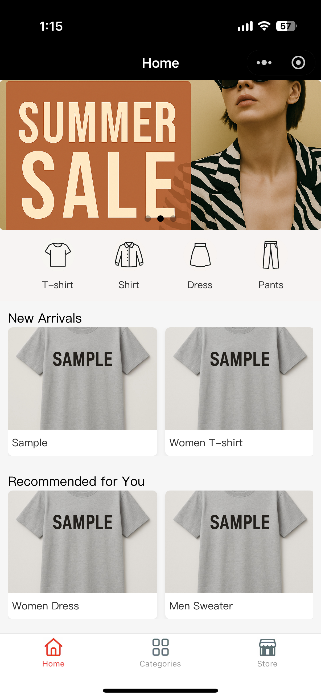

#### Category Page
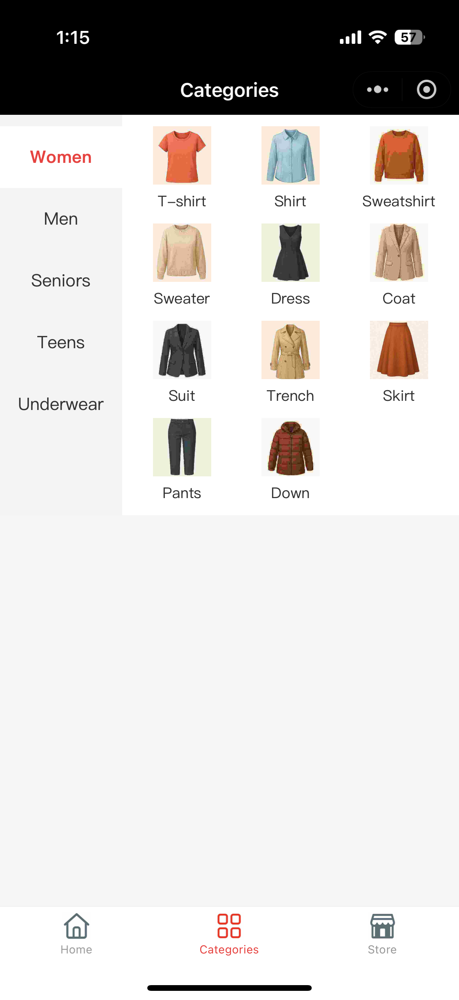
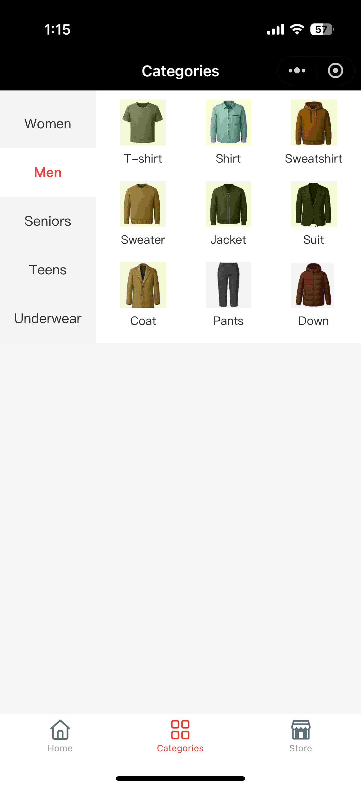

#### Product List
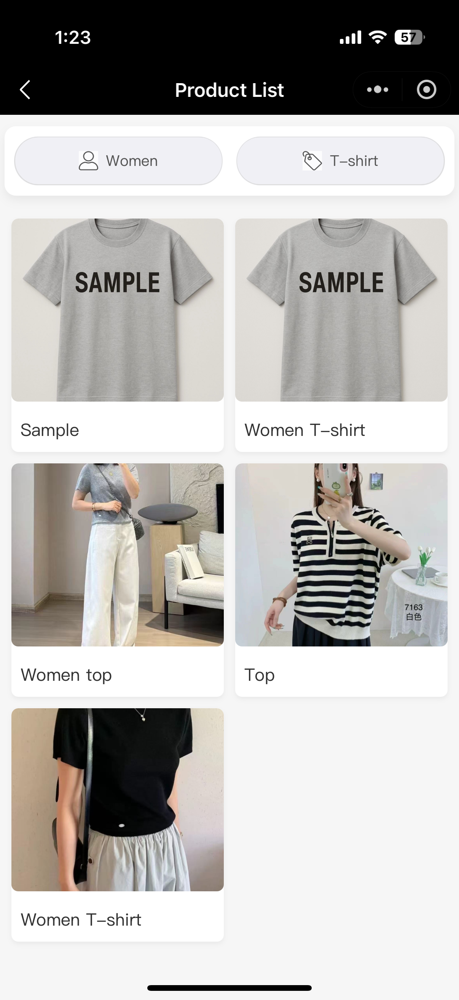

#### Product Details
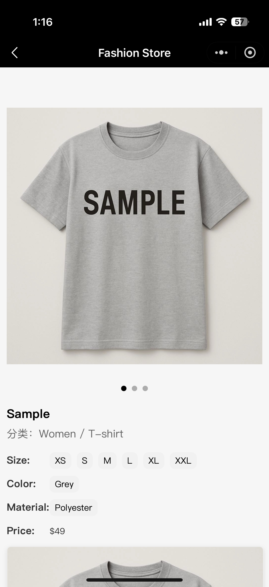
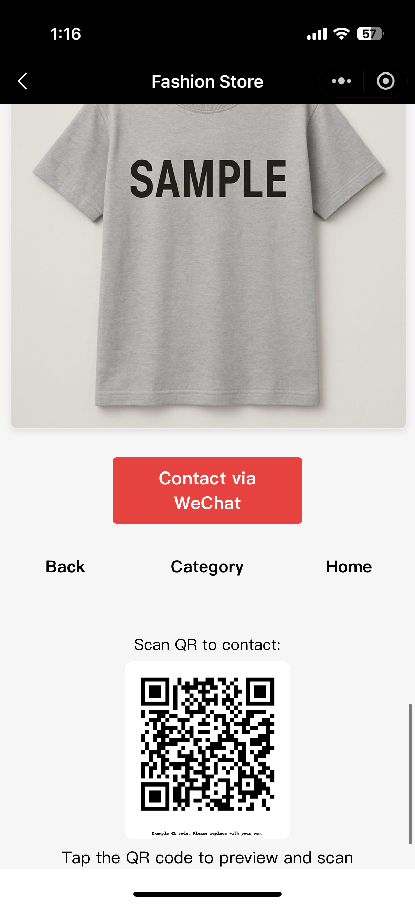

#### Store Information Page
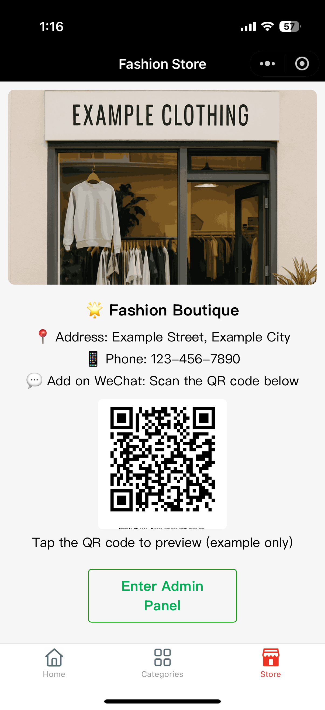

#### Admin Panel
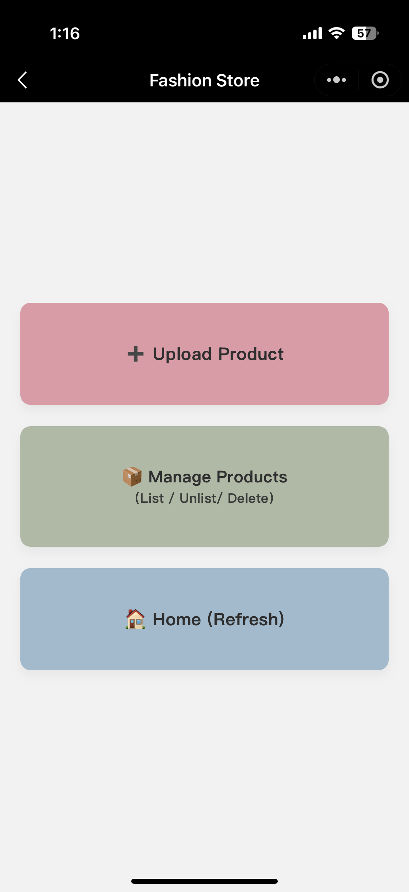

#### Add New Product
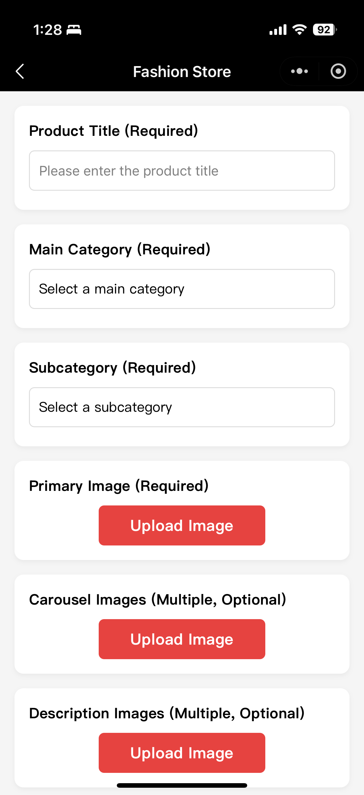
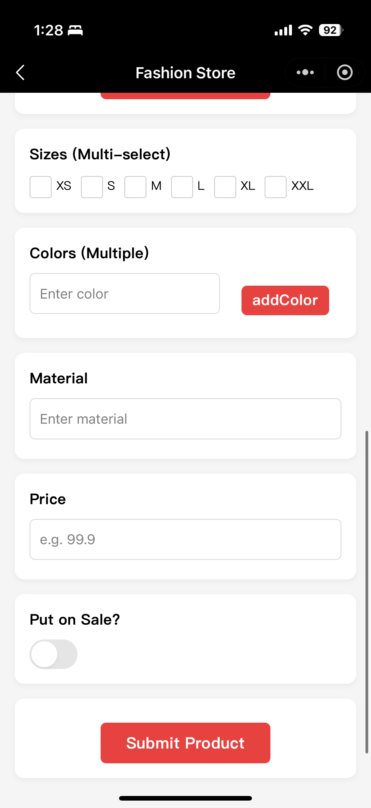

#### Edit Product
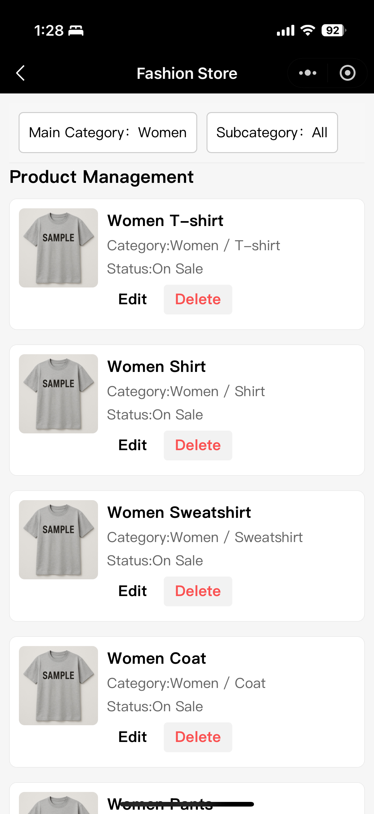
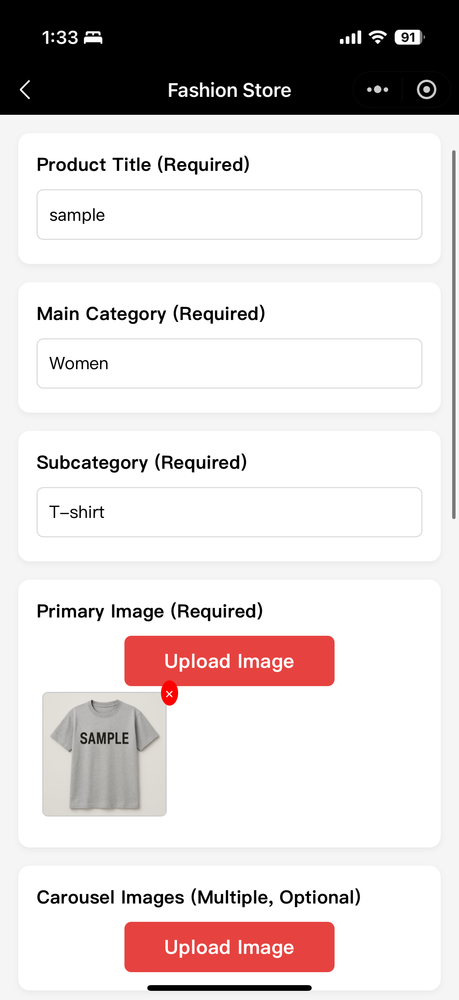
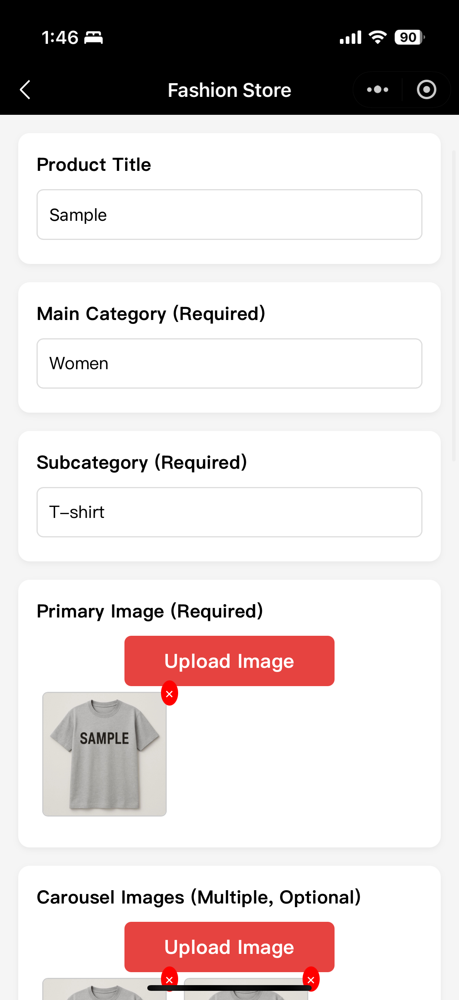
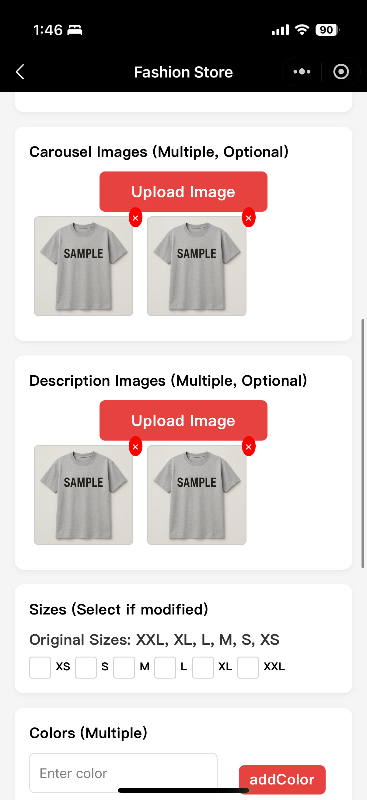
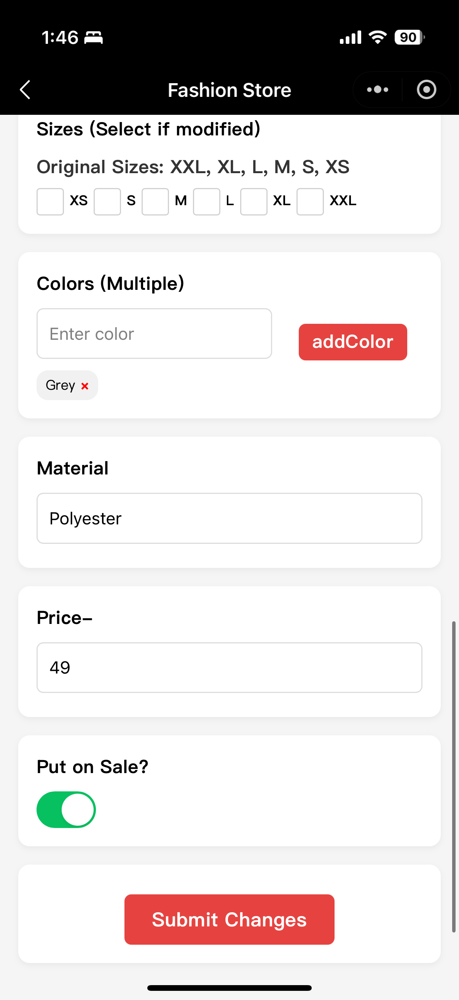
